# WDProjLithiumLaraLibo-on Project Proposal

## 88 Keys 

Project Repository for SY2526 CS 3 Project 

LARA, Travis Marco M.

LIBO-ON, Nathan Allen L.

9 LITHIUM BATCH 2029

PHILIPPINE SCIENCE HS - MC 

# Description

## Our website aims to inform people about an instrument we have come to love, piano's! We will be dwelling on the history of the piano and the people who contributed in making this wonderful instrument. Furthermore, we will be showing the insides of the piano and how it actually works. For those interseted to learn how to play this instrument, we will be adding a cheat sheet of important piano chords. All in all, we want to educate people about the piano and hopefully interest some into learning this wonderful piece of music!

# Outlines

### **I. Homepage** 
  * A. The Description of the Website
    1. The paragraph above is what we are going to put for this
  * B. Boxes for the other pages
    1. This will show the description for the other webpages and the navigation to these said webpages
  * C. Footer
    1. This will contain the references and copyright
### **II. History of the Piano**
  * A. Timeline
    1. Details about how the piano was made and the diffirent people who contributed to the creation of the piano.
  * B. Images
    1. Along with the written details, we will show images of the people who contributed and the different advances of the piano from the first piano ever made to the current capabilities of the piano.
### **III. Mechanisms of the Piano**
  * A. Parts of the Piano
    1. An informative page about the different parts of the piano and how each works
  * B. Images
    1. Images that will help the reader visualize the different parts.
### **IV. Important Chords** 
  * A. The Different Chords
    1. A cheat sheet on the important chords that piano players should know
  * B. Audio Files
    1. An audio file for each chord that when played will let the user hear what each chord sounds like.
### **V. Interactive Piano**
  * A. JS Piano\
    1. An interactive piano that users can play by using either their mouse or the keyboard.

# JavaScript Usage
JavaScript will be used primarily to add the element of interactivity in the Interactive Piano part, with functions to be called and return specific values in order for notes to be properly played by the user upon the click of keys on their keyboard.

# Wireframes

## Home Page: 
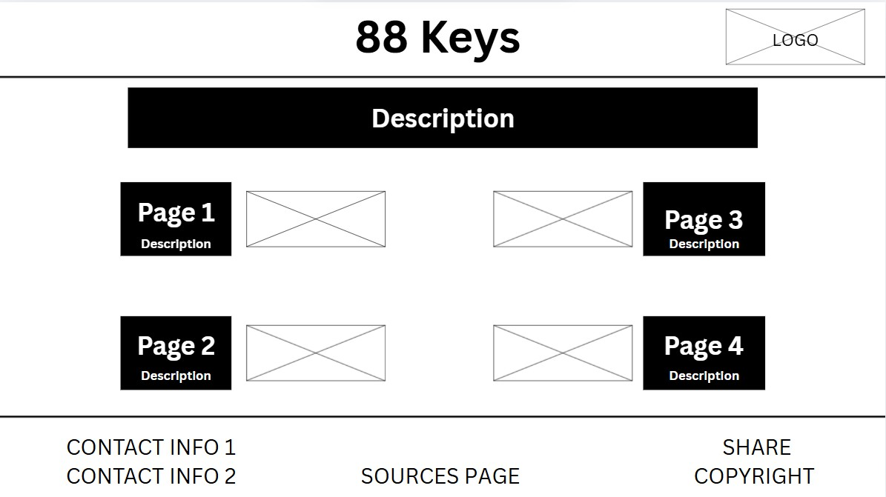

## Page 1

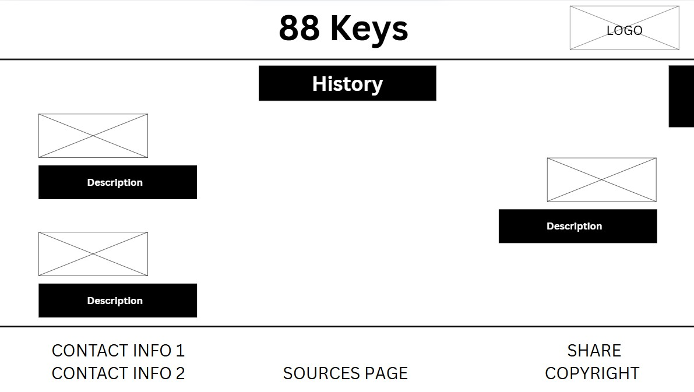

## Page 1 Expanded

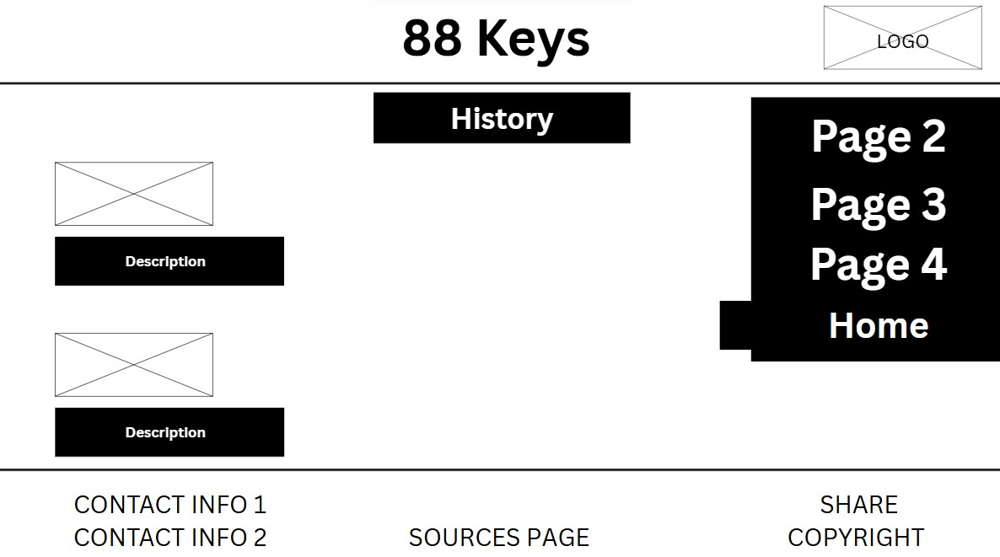

## Page 2

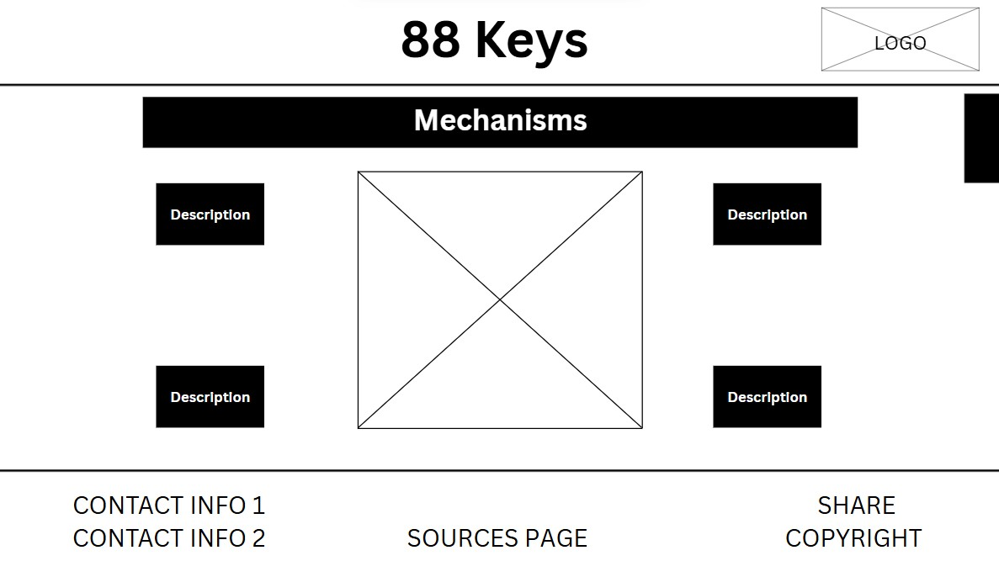

## Page 2 Expanded

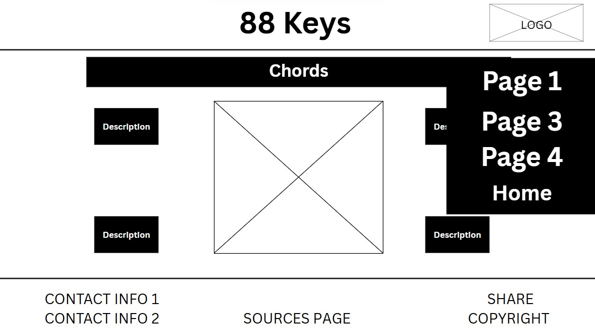

## Page 3

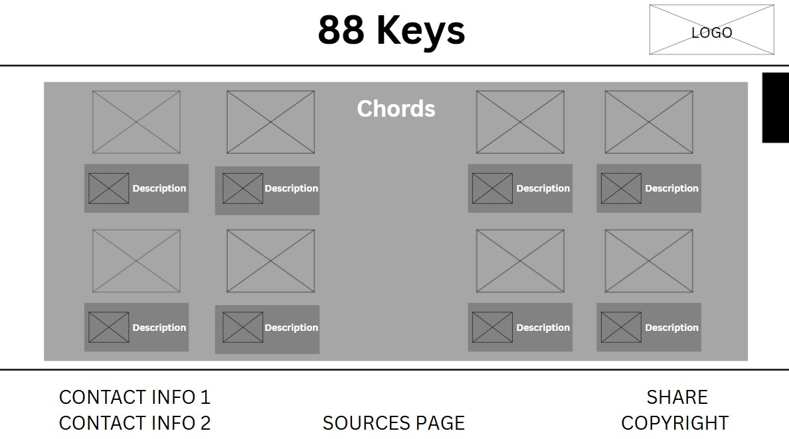

## Page 3 Expanded

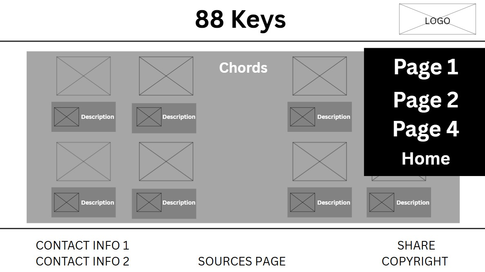

## Page 4

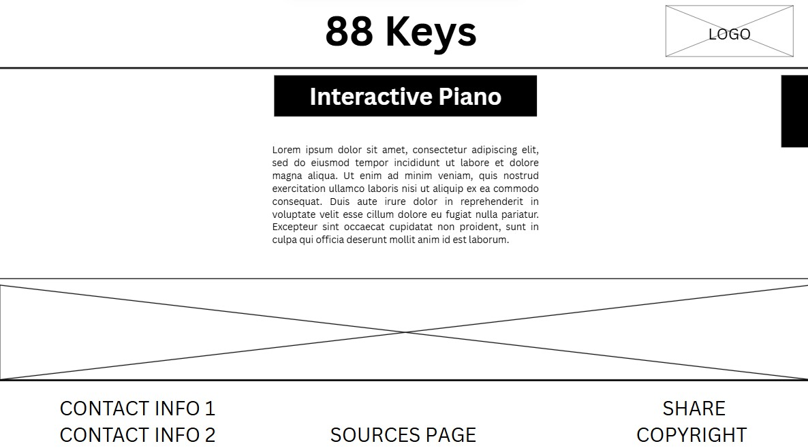

## Page 4 Expanded

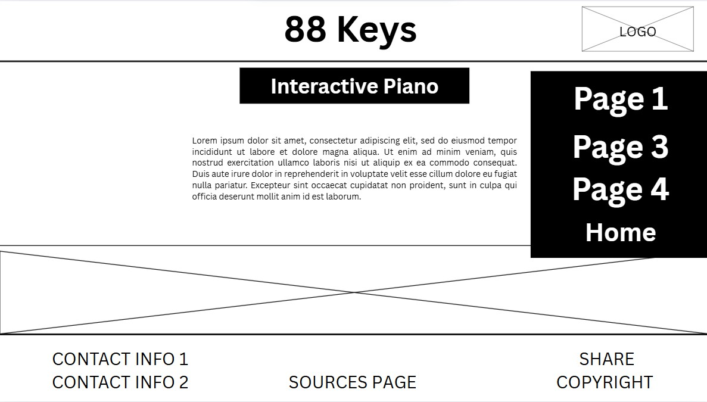

# HTML Forms: Piano Practice Planner

## HTML Form Usage 
HTML forms will be incorporated into the website such that they will extract the how much the user spends practicing the piano (in hours), and aid in the selection of practice plans 

# Outlines

### **VI. Sign up for PPP** 
  * A. Links to page 6 and 7
    1. Once the form is completed, the gathered info will be saved w the user will unlock the navigation to pages 6 and 7.
  * B. Info Boxes
    1. The user will input the required info here to unlock the PPP
    2. Info such as name, age, skill level (beginner, intermediate, advanced), preffered genre (Jazz, Clasical, Pop, etc.), practice duration per day currently, how often they practice in a week, and their main goal (faster fingers, learn a new piece, etc.)
  * C Links to page 6 and 7
    1. Once the form is completed, the gathered info will be saved w the user will unlock the navigation to pages 7 and 8.
### **VII. PPP for user**
  * A. Main PPP
    1. A Piano Practice Plan will be made for the user using the info inputed in page 5.
  * B. Feedback and Recommendations
    1. A set of pre made recommendations for improvement will be made in accordance with the inputed info.
### **VIII. Resources for user**
  * A. Images
    1. A set of images that align with the users goal will appear to aid the user in their practices
  * B. Audio Files
    1. A set of audio files containing recommended songs to learn will appear based on the users preffered genre.
    C. Videos
    1. A set of youtube videos will appear based on the users skill level to help the user further progress.
   
# Wireframe:

## Page 5: 

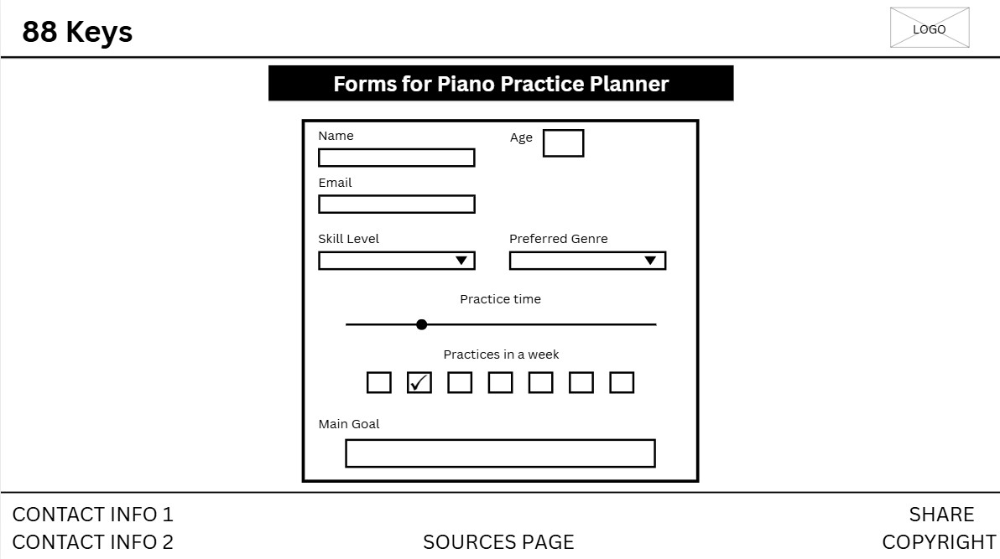

## Page 6: 

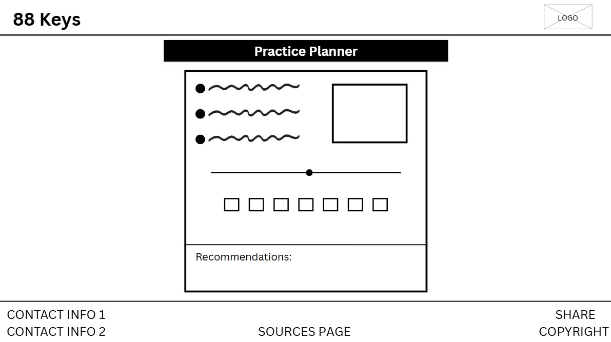

## Page 7: 

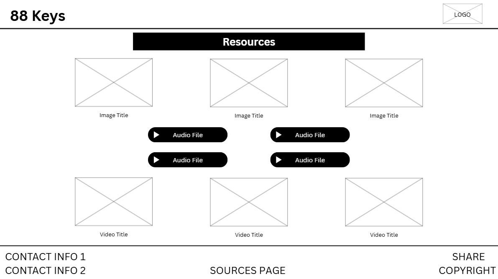
